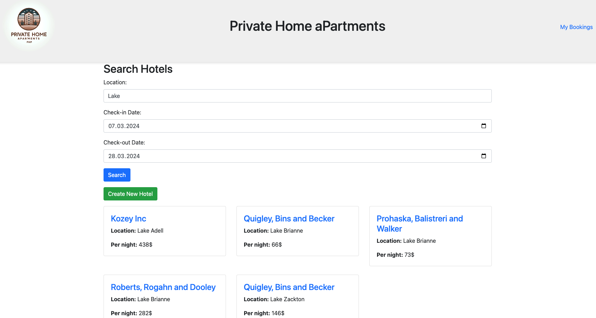

# 📦 Backend rentals_index endpoint


## Rental controller

We will start by building the `RentalController.php`. This controller will be first responsible for handling the `rentals_index` endpoint.

```php
<?php
namespace App\Controller;
use Symfony\Component\HttpFoundation\Request;
use Symfony\Component\HttpFoundation\Response;

use App\Document\Rental;
use App\Document\Booking;
use App\Form\RentalType;
use App\Document\Rental;
use Doctrine\ODM\MongoDB\DocumentManager;
use Symfony\Component\Routing\Annotation\Route;
use MongoDB\BSON\Regex;

use Psr\Log\LoggerInterface;

/*
    * RentalController
    ---------------------
    * This class is responsible for handling the rental query and booking operations.
*/
class RentalController extends AbstractController
{
    // DocumentManager instance
    private $documentManager;
    private $logger;
    // Constructor to initialize the DocumentManager and LoggerInterface
    public function __construct(DocumentManager $documentManager , LoggerInterface $logger)
    {
        $this->documentManager = $documentManager;
        $this->logger = $logger;
    }

    // Index action to display all the rentals or filter by city and availability
    #[Route('/', name: 'rental_index', methods: ['GET'])]
    public function index(Request $request): Response
    {
        // Get the city, check-in and check-out dates from the query parameters
        $city = $request->query->get('city');
        $checkIn =  new \DateTime($request->query->get('check_in'));
        $checkOut =  new \DateTime($request->query->get('check_out'));


        // Fetch all the rentals
        if ($city && $checkIn && $checkOut) {
            // Fetch rentals based on city and availability
            // The availability field is an array of objects with start_date and end_date fields
            // So we use elemMatch to query the availability array and see if the user requested dates are available
            $rentalRepository = $this->documentManager->getRepository(Rental::class);
            $queryBuilder = $rentalRepository->createQueryBuilder();

            
            $rentals = $queryBuilder
                ->field('location')->equals(new Regex( $city , 'i'))
                ->field('availability')->elemMatch(
                    $queryBuilder->expr()
                        ->field('start_date')->lte($checkIn)
                        ->field('end_date')->gte($checkOut)
                )
                ->getQuery()
                ->execute();

        } else {
            // Fetch all the rentals
            $rentals = $this->documentManager->getRepository(Rental::class)->findAll();
        }
        // Render the rentals page
        return $this->render('rental/index.html.twig', ['rentals' => $rentals]);
    }

}
```

In the `RentalController.php` we have defined the `index` method which is responsible for fetching all the rentals or filtering them based on the city and availability. We are using the `QueryBuilder` to build the query and fetch the rentals based on the city and availability. We are also using the `elemMatch` to query the availability array and see if the user requested dates are available.

Now we can adjust the needed routes in the `config/routes.yaml file. We will also define future routes for the page to load

## Adjust routing 

```yaml
# main routes
# create a new rental
rental_create:
    path: /rental/create
    controller: App\Controller\RentalController::create
    methods: [GET, POST]

# show a rental
rental_details:
    path: /rental/{id}
    controller: App\Controller\RentalController::details
    methods: [GET]

# book a rental
rental_book:
    path: /rental/book/{rentalId}
    controller: App\Controller\RentalController::book
    methods: [POST]

# list all bookings
booking_index:
    path: /booking
    controller: App\Controller\BookingController::index
    methods: [GET]
```

The routes in our application are:
- `rental_create [GET , POST]` - to create a new rental
- `rental_details [ GET ]`  - to show a rental
- `rental_book [POST]` - to book a rental
- `booking_index [GET]` - to list all bookings

## Create the rental index html twig

Now we can create the `rental/index.html.twig` file to render the rentals page.

```html
{# templates/rental/index.html.twig #}






Rental List


    <div class="container">
           <h2>Search Rentals</h2>
        <form action="{{ path('rental_index') }}" method="get">
            <div class="form-group">
                <label for="city">Location:</label>
                <input type="text" id="city" name="city" class="form-control" value="{{ app.request.query.get('city') }}" required>
            </div>
            <div class="form-group">
                <label for="check_in">Check-in Date:</label>
                <input type="date" id="check_in" name="check_in" class="form-control" value="{{ app.request.query.get('check_in') }}" required>
            </div>
            <div class="form-group">
                <label for="check_out">Check-out Date:</label>
                <input type="date" id="check_out" name="check_out" class="form-control" value="{{ app.request.query.get('check_out') }}" required>
            </div>
            <button type="submit" class="btn btn-primary">Search</button>
        </form>

        
       
        <a href="{{ path('rental_create') }}" class="btn btn-success my-3">Create New Rental</a>
        <div class="row">
            
                <div class="col-md-4 mb-4">
                    <div class="card">
                        <div class="card-body">
                            <h4>
                                <a href="{{ path('rental_details', {
                                    'id': rental.id,
                                    'city': currentCity,
                                    'check_in': currentCheckIn,
                                    'check_out': currentCheckOut
                                }) }}">{{ rental.name }}</a></h4>
                            <p class="card-text"><b>Location:</b> {{ rental.location }}</p>
                            <p class="card-text"><b>Per night:</b> {{ rental.nightCost }}$</p>
                            
                            <!-- Add more rental details here -->
                        </div>
                    </div>
                </div>
            
        </div>
    </div>


```

## Start the server

Now we can load the initial page of our application:
```bash
symfony server:start
```

Once application loaded we can navigate to the `http://localhost:8000` to see the rentals page. We can also filter the rentals based on the city and availability.

## When we finish this page we will have the following functionalities:
- Fetch all the rentals
- Filter rentals based on city and availability

Now we will move to the next page to create a new rental and list details of a rental.