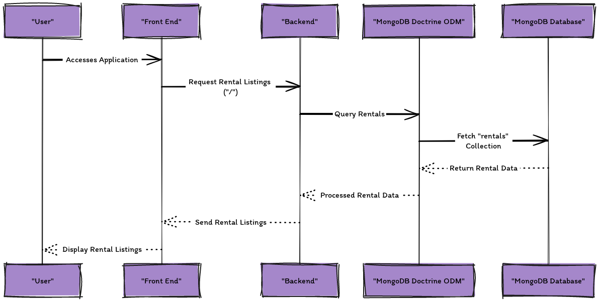
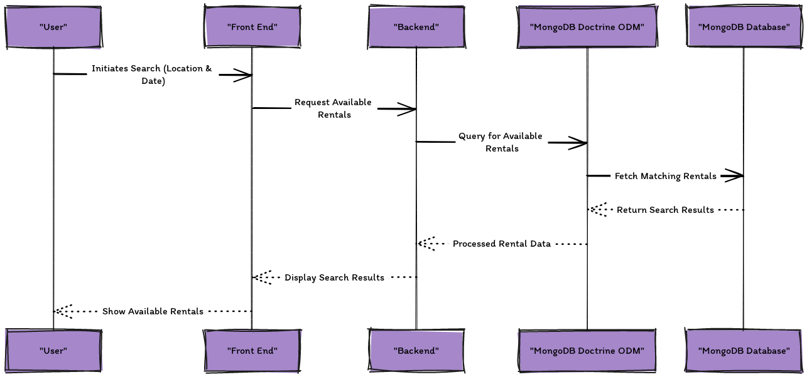

# 📋 List all rentals

Lets list all rentals in the database. We will use `http://localhost:8000` after the server is started:
```bash
symfony server:start
```

Sometimes you may need to clear the cache before you can see the changes in the browser. You can do this by running the following command in the terminal:
```bash
php bin/console cache:clear
```

The following diagram shows the sequence of requests and responses that are made when the `http://localhost:8000` is accessed in the browser:



## Search for a rentals

You can search for a rental by providing a location in the search bar and a set of start and end dates.

The following diagram shows the sequence of requests and responses that are made when the search button is clicked:
