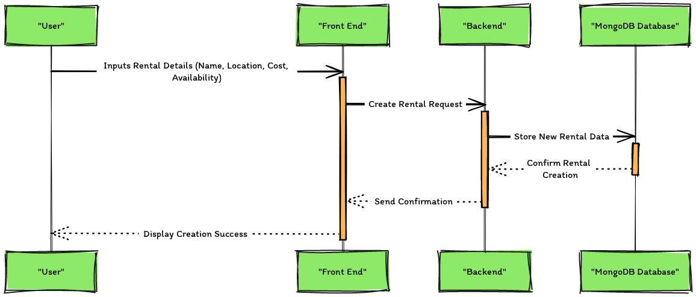
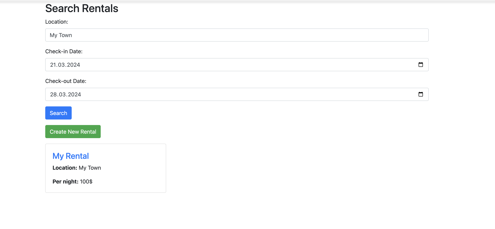
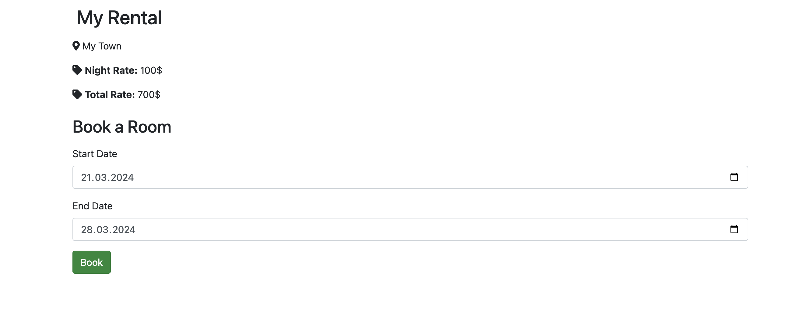
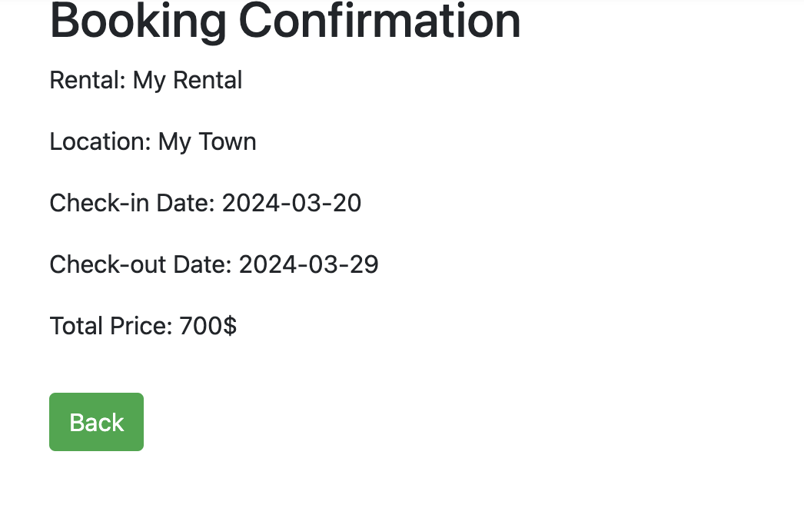
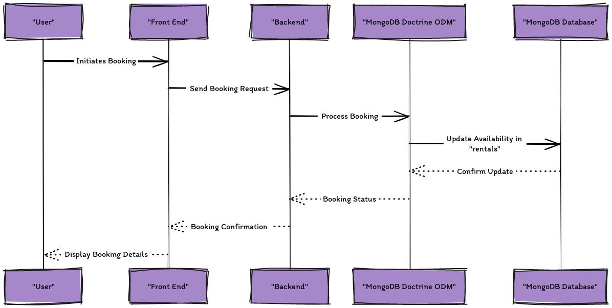
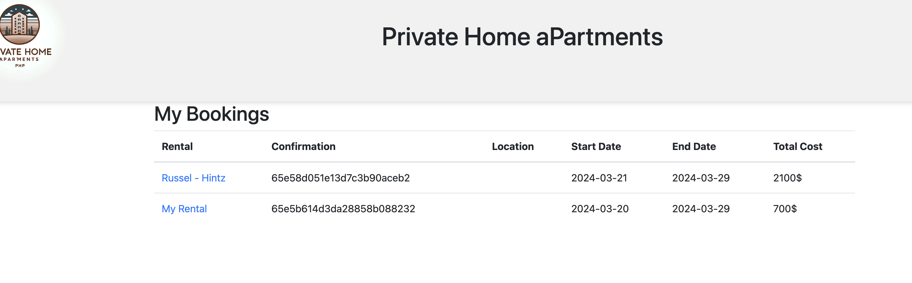

# ✨ Create rentals and List a specific rental

## Create a rental

The button on the main rental page will take you to the rental creation page. Here you can fill out the form to create a rental. The form will ask for the following information:

- Rental Name
- Location
- Night Price

Once you have filled out the form, click the "Create Rental" button to create the rental. You will be redirected to the rental page where you can see the rental you just created.

The rental create sequence is as follows:

## List a specific rental

Once the rental is created (eg. "My Rental" in "My Town"), we can search it. Lets try to locate: Location: "My Town" for dates between 2024-03-20 and 2021-03-29.

When we find the rental "My Rental" in "My Town", we can click on it to see the details of the rental. The rental details page will show the following information:

We can now click the "book" button and we should recieve a confirmation message.

The sequence diagram is as follows:

## Go to "My Bookings"

Once we have booked a rental, we can go to the "My Bookings" link to see the rentals we have booked. The "My Bookings" page will show the following information:

